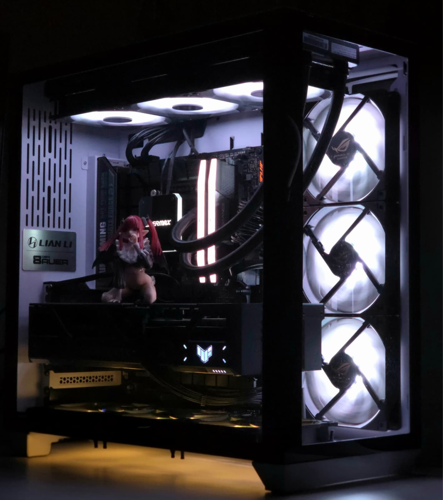

    

  
  
  
  
  
  

  <table>
    <tr>
      <td align="center">
        
         
        <b>20 Cores | 28 Threads</b>
      </td>
      <td align="center">
        
         
        <b>Next-Gen Graphics</b>
      </td>
      <td align="center">
        
         
        <b>High Speed Memory</b>
      </td>
    </tr>
  </table>

